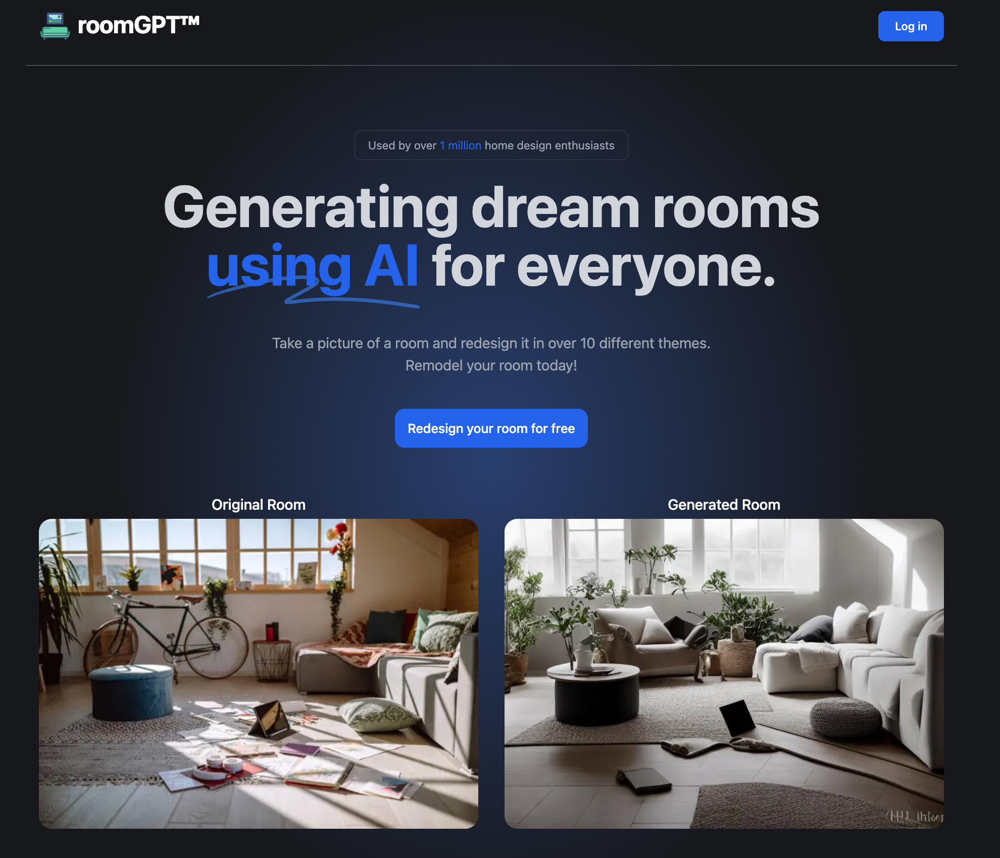

<<<<<<< HEAD
This is a [Next.js](https://nextjs.org/) project bootstrapped with [`create-next-app`](https://github.com/vercel/next.js/tree/canary/packages/create-next-app).

## Getting Started

First, run the development server:

```bash
npm run dev
# or
yarn dev
# or
pnpm dev
# or
bun dev
```

Open [http://localhost:3000](http://localhost:3000) with your browser to see the result.

You can start editing the page by modifying `app/page.tsx`. The page auto-updates as you edit the file.

This project uses [`next/font`](https://nextjs.org/docs/basic-features/font-optimization) to automatically optimize and load Inter, a custom Google Font.

## Learn More

To learn more about Next.js, take a look at the following resources:

- [Next.js Documentation](https://nextjs.org/docs) - learn about Next.js features and API.
- [Learn Next.js](https://nextjs.org/learn) - an interactive Next.js tutorial.

You can check out [the Next.js GitHub repository](https://github.com/vercel/next.js/) - your feedback and contributions are welcome!

## Deploy on Vercel

The easiest way to deploy your Next.js app is to use the [Vercel Platform](https://vercel.com/new?utm_medium=default-template&filter=next.js&utm_source=create-next-app&utm_campaign=create-next-app-readme) from the creators of Next.js.

Check out our [Next.js deployment documentation](https://nextjs.org/docs/deployment) for more details.
=======
# [RoomGPT](https://roomGPT.io) - redesign your room with AI

This is the previous and open source version of RoomGPT.io (a paid SaaS product). It's the very first version of roomGPT without the auth, payments, or additional features and it's simple to clone, deploy, and play around with.

[](https://vercel.com/new/clone?repository-url=https://github.com/Nutlope/roomGPT&env=REPLICATE_API_KEY&project-name=room-GPT&repo-name=roomGPT)

[](https://roomGPT.io)

## How it works

It uses an ML model called [ControlNet](https://github.com/lllyasviel/ControlNet) to generate variations of rooms. This application gives you the ability to upload a photo of any room, which will send it through this ML Model using a Next.js API route, and return your generated room. The ML Model is hosted on [Replicate](https://replicate.com) and [Bytescale](https://www.bytescale.com/) is used for image storage.

## Running Locally

### Cloning the repository the local machine.

```bash
git clone https://github.com/Nutlope/roomGPT
```

### Creating a account on Replicate to get an API key.

1. Go to [Replicate](https://replicate.com/) to make an account.
2. Click on your profile picture in the top left corner, and click on "API Tokens".
3. Here you can find your API token. Copy it.

### Storing the API keys in .env

Create a file in root directory of project with env. And store your API key in it, as shown in the .example.env file.

If you'd also like to do rate limiting, create an account on UpStash, create a Redis database, and populate the two environment variables in `.env` as well. If you don't want to do rate limiting, you don't need to make any changes.

### Installing the dependencies.

```bash
npm install
```

### Running the application.

Then, run the application in the command line and it will be available at `http://localhost:3000`.

```bash
npm run dev
```

## One-Click Deploy

Deploy the example using [Vercel](https://vercel.com?utm_source=github&utm_medium=readme&utm_campaign=vercel-examples):

[](https://vercel.com/new/clone?repository-url=https://github.com/Nutlope/roomGPT&env=REPLICATE_API_KEY&project-name=room-GPT&repo-name=roomGPT)

## License

This repo is MIT licensed.
>>>>>>> 20b3c40c1e6e0605461a307d803ff1d9b1189b53
